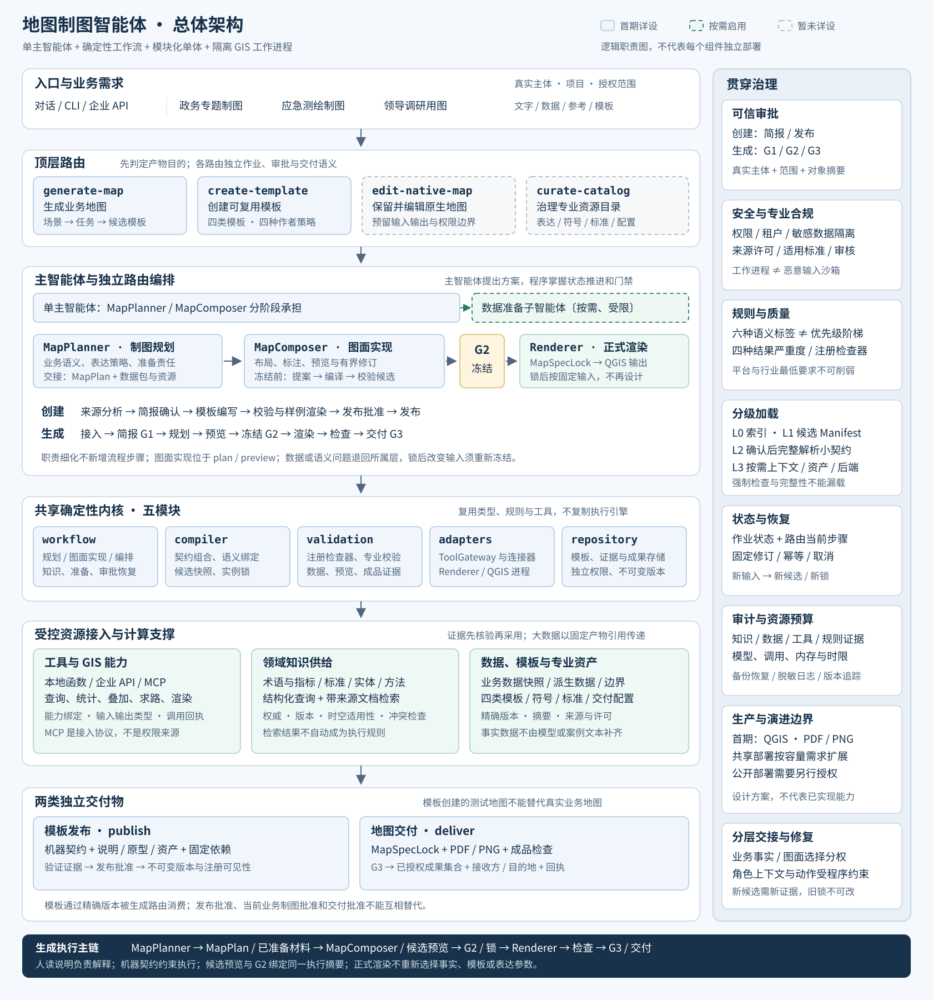

# 地图制图智能体总体架构设计方案

## 文档信息

| 项目 | 内容 |
|---|---|
| 系统名称 | 地图制图智能体（Carto Agent） |
| 文档版本 | 1.1 |
| 日期 | 2026-09-11 |
| 状态 | 架构设计稿；文中的程序、接口和部署为拟实现方案 |
| 实现基线 | [地图生成 TRD v1.2](carto-generate-map-TRD.md)、[模板创建 TRD v1.1](carto-create-template-TRD.md) |
| 本文范围 | 系统分层、职责和依赖、跨路由协议、数据与知识、部署及生产保障 |
| 暂不详设 | `edit-native-map`、`curate-catalog` 的内部流程与实现 |
| 配图 | [总体架构 SVG](carto-agent-architecture.svg) |

本文面向独立的地图制图智能体，不是 PPT Master 的地图插件或 PPT 生成流程。当前仓库承载设计文档，不代表 Carto Agent 已经实现。

本文负责系统级边界和集成关系；具体字段、步骤、门禁和命令继续由两份 TRD 拥有，本文不建立第二套执行规范。模板概念可参考[模板体系设计](carto-template-dsg.md)，建设顺序可参考[原实施计划](implement-plan.md)；其中尚存的旧契约数量、动态加载图或旧命令不作为并行实现。实施时须按最新版 TRD 对齐。

本版明确“制图规划 MapPlanner → 图面实现 MapComposer → 冻结后确定性渲染 Renderer”的职责。MapComposer 是对现有 `plan/preview` 内部职责的细化，不新增路由、作业步骤、独立智能体或业务契约；原有两份 TRD 的流程与冻结协议保持不变。

## 一、架构结论与设计目标

采用“单主智能体 + 确定性工作流 + 模块化单体内核 + 隔离 GIS 工作进程”，在复杂数据任务中按需启用一个数据准备子智能体。

主智能体理解需求、提出制图方案并协调执行；程序掌握状态推进、权限校验、数据和空间计算、契约编译、质量门禁与发布交付。模型输出是有证据的候选决定，不是可直接执行的任意代码，也不是审批证明。

业务职责分为制图规划层与制图实现层。规划层拥有业务语义、表达策略和准备责任；实现层先由 MapComposer 在约束内形成具体图面，G2 冻结后再由 Renderer 按锁输出。首期主智能体分阶段承担 MapPlanner 与 MapComposer，独立校验与可信审批约束整个过程，不以两个角色替代两个安全边界。

该设计同时满足四项目标：

1. 业务可用：覆盖政务专题、应急测绘和领导调研，能够处理“只有文字”“已有数据”“已有模板”等不同输入。
2. 制图可信：统计口径、坐标、分类、符号、线路与时效可检查，不能仅凭地图外观验收。
3. 企业可控：身份、数据权限、审批、隔离、成本、审计和恢复从首期生产开始具备。
4. 演进适度：以模块和接口隔离变化，按实际瓶颈扩容，不预先建设全套微服务或通用多智能体平台。

| 架构决定 | 选择依据 | 代价及控制办法 |
|---|---|---|
| 两条主流程独立，共享内核 | 创建模板与生产地图的目标、审批和产物不同 | 共享类型与工具，不复制规则引擎 |
| 规划与实现分责，图面决定在冻结前收敛 | 业务判断、图面设计和正式渲染需要不同自由度 | 同一主智能体分阶段承担；通过既有计划、候选与锁交接 |
| 四类模板、分段所有权 | 身份、表达、结构、场景各有稳定复用边界 | 显式替换分段，编译时检查冲突 |
| 数据准备默认固定流程 | 常见数据接入不需要独立智能体 | 复杂任务可启用受控委派，接口不变 |
| 业务依赖能力，不绑定 MCP 工具名 | 本地 GIS、企业 API 和 MCP 都可能提供同一能力 | 网关统一类型、授权和调用证据 |
| 知识服务提供依据，契约与检查器执行规则 | 检索相关性不等于权威性或完整性 | 固定适用标准与已采用证据 |
| 预览候选与正式执行共用执行摘要 | 避免审批的图与实际输出不是同一方案 | 输入变化重新形成候选和锁 |
| QGIS 优先，PDF/PNG 首期交付 | 先建立可验证的完整制图链路 | 图册、Web、移动端及其他引擎按证据开放 |

## 二、业务范围与能力边界

### 2.1 首期三类业务场景

| 业务场景 | 已明确方向 | 主要任务 | 特别约束 |
|---|---|---|---|
| 政务专题制图 `government_thematic` | 行政区划、经济发展、科技创新、现代产业、对外开放、文旅融合、交通运输 | 行政底图、统计专题、设施分布、交通网络等 | 指标定义、分母与单位、统计年份、行政区划版本、跨图比较口径 |
| 应急测绘制图 `emergency_mapping` | 地质滑坡、洪涝灾害、森林火灾 | 已核实灾情或监测成果表达、承灾体叠加、重点设施标注 | 事件阶段、观测时点、数据性质、覆盖缺口、不确定性与时效 |
| 领导调研用图 `leadership_visit` | 行程文字到地点和线路表达 | 地点解析、顺序保持、路线生成或引用、调研点标注 | 地点歧义、路线形态、坐标来源、行程保密、按提供顺序访问 |

政务专题目标是十个方向，目前只有七个名称得到明确，其余三个保留为待确认业务项。场景列入目录不等于已经实现；每个对外声明的任务必须同时具有工具能力、数据前提和验收证据。

应急首期负责表达获准的调查、监测和分析结果，不默认包含从遥感影像自动提取灾害、预测灾情或指挥决策。领导调研的实际道路路线不能用直线替代；只有明确采用示意路线时才使用示意表达并作标识。

### 2.2 面向用户的产品边界

系统接受文字、表格、地理数据、获准服务引用、地图参考材料和已发布模板引用。没有足够数据时先生成缺口与数据需求，不生成虚假观测值。

首期正式成果为经检查的 PDF/PNG 及配套交付清单。可编辑 GIS 项目、图册、Web 或移动端结果只在对应适配器能力与许可得到验证后交付。生成可供 Web 使用的文件，不等于获准部署到公网。

## 三、总体架构图



图中实线框为首期需要实现的逻辑职责；绿色虚线框为按需数据子智能体；灰色虚线框为暂未详设的路由。连线表达主要调用和产物流向，不表示每个框都要单独部署。

系统从上到下分为入口、路由、编排、共享内核、资源接入和产物六层；右侧为贯穿所有层的治理能力。知识服务、数据准备服务和工具网关分别位于五模块内部，不额外增加三套微服务。

图中 MapPlanner 和 MapComposer 属于同一主智能体的阶段职责；Renderer 属于适配器及 GIS 工作进程。两类业务职责与六层技术结构是不同视角，不能把角色框再解释为新增服务。G2 位于候选实现与正式渲染之间，不位于所有图面设计之前。

### 3.1 逻辑分层

| 层次 | 主要职责 | 对下一层的约束 |
|---|---|---|
| 入口层 | 对话、CLI 或企业 API；接收请求与文件，建立真实主体和项目上下文 | 用户文本不能直接声明自己拥有系统权限 |
| 路由层 | 区分产物目的，再识别业务场景、任务和可用能力 | 不用关键词直接选定唯一模板 |
| 编排层 | 主智能体的 MapPlanner/MapComposer 职责、两个独立工作流、审批、修订与受控委派 | 模型建议先进入类型化计划和检查；图面调整在冻结前完成 |
| 内核层 | 编译、验证、能力调用、持久化；形成统一执行输入 | 不执行模板或模型携带的任意代码 |
| 资源层 | 数据服务、知识来源、模板与资产、GIS 引擎 | 来源、版本、许可和可用性须可追踪 |
| 产物层 | 不可变模板版本，或独立地图成果与交付证据 | 模板发布与地图交付使用不同事务和权限 |

### 3.2 控制、计算和证据分离

控制链处理“为什么做、允许做什么、当前走到哪一步”；计算链处理“读取哪些数据、如何变换和渲染”；证据链记录“依据、输入、工具、规则、审批和实际结果”。

大体积几何、栅格和图像留在受控文件或对象存储中，模型只接收必要摘要和产物引用。任何一条链路失败，都不能用另一条链路的成功替代：模型说完成不等于质量通过，渲染成功不等于获得交付许可。

## 四、顶层路由与独立性

| 路由 | 入口目的 | 核心产物 | 本期设计深度 |
|---|---|---|---|
| `generate-map` | 针对当前业务数据生产一张或一组地图 | 实例锁、地图成果包、检查与交付回执 | 详设，见地图生成 TRD |
| `create-template` | 从需求或参考材料提炼可复用规则 | 已验证的模板包及不可变发布版本 | 详设，见模板创建 TRD |
| `edit-native-map` | 保留既有原生 GIS 工程并修改对象 | 保留工程语义的修订结果 | 仅保留入口、输入输出与权限边界 |
| `curate-catalog` | 治理地图表达、符号、标准及交付配置 | 经审查的目录版本和证据 | 仅保留入口、输入输出与权限边界 |

原生工程作为“重新制图的参考材料”与“需要保留并编辑的工程”是两种目的。不能因为出现 QGIS 文件就自动进入编辑路由，也不能把原始工程当作已注册模板。

每条路由拥有独立的请求、作业、审批对象、步骤和产物命名空间。路由间通过精确版本的产物引用交接，不共享可变工作目录，也不继承另一条路由的批准结果。

生成任务缺模板时，可以采用经确认的无模板或部分模板方案；不能自动调用模板发布。需要新建模板或新增公共符号时，应记录缺口，另建有独立授权的作业，再由原作业选择其发布结果。

对暂未实现的编辑和目录治理路由，入口返回明确的能力未开放状态，不降级为其他路由继续写入。首期仍须由受信维护流程配置基础符号、标准和能力注册表；暂不详设治理路由不等于取消基础治理。

## 五、共享内核与模块依赖

沿用两份 TRD 的五模块组织，不按每个职责对象拆服务。

| 模块 | 主要职责对象 | 负责 | 不负责 |
|---|---|---|---|
| `workflow` | 路由工作流、IntentResolver、MapPlanner、MapComposer、DomainKnowledgeService、DataPreparationService、审批协调 | 意图、规划与图面提案、预览修订编排、业务决定的证据化、步骤推进与恢复 | 自行实施空间算法、绕过审批、直接改发布索引 |
| `compiler` | ContractCompiler、所有权解析、MapPlan/Lock 构造 | 类型校验、分段组合、语义绑定、候选解析和执行快照 | 联网获取数据、签发审批、渲染地图 |
| `validation` | 注册检查器、数据/空间/表达/成品校验 | 对指定输入、规则和环境给出可追踪检查结果 | 动态安装模型生成的规则、把自评作为验收 |
| `adapters` | ToolGateway、本地/API/MCP 连接器、QGIS 适配器与 Renderer | 受控能力调用、协议转换、隔离工作进程、候选预览与锁后正式渲染 | 自主改变业务语义或冻结参数 |
| `repository` | 模板、证据、快照、成果存储访问 | 不可变产物、版本引用、索引、发布和交付持久化 | 把不同仓库权限合并为通用读写权 |

`workflow` 编排其他模块；`compiler` 面向已经准备的类型化输入和固定引用，尽量保持纯计算；`validation` 通过明确接口请求必要的渲染检查；`adapters` 不反向调用业务规划。共享领域类型与 Schema 不引用具体工作流，避免循环依赖。

MapComposer 不是第二个编译器：它提出并组织图面参数修订；compiler 负责解析、校验和生成完整候选。Renderer 不是图面设计智能体：同一适配器可在冻结前渲染候选、冻结后渲染实例锁，两种模式都不重新选择事实或设计参数。

建议通过以下逻辑接口集成；完整请求与返回字段由对应 TRD 和未来 Schema 定义：

| 接口 | 调用方 → 被调用方 | 关键边界 |
|---|---|---|
| 意图解析与任务分派 | 主流程 → IntentResolver / TaskDispatcher | 返回结构化意图、证据、缺项和受信策略键 |
| `lookup_or_search(...)` | 意图/规划/数据准备 → DomainKnowledgeService | 返回有版本与适用性的知识证据 |
| `prepare_data(...)` | 生成流程 → DataPreparationService | 输入批准需求，输出待验收数据包 |
| `invoke(capability_id, typed_input, execution_context)` | 工作流/数据准备 → ToolGateway | 身份与授权由宿主注入，返回类型化结果及回执 |
| 图面实现与修订 | 主流程 → MapComposer | 消费明确修订的 MapPlan、准备材料及检查反馈；返回类型化修订提案或缺口，不直接写锁 |
| 编译与冻结接口 | 工作流 → compiler | 输入固定依赖和有效计划，不在冻结时重新推理 |
| 检查与渲染接口 | 工作流/validation → adapters | 引用候选或锁及指定目标，返回产物引用 |
| `publish` / `deliver` | 对应路由 → repository | 两种独立语义，均验证批准对象与目标 |

## 六、智能体、工具与审批的职责分工

### 6.1 单主智能体基线

主智能体拥有用户沟通、业务理解、表达建议、数据需求和整体协调，在规划与实现阶段分别承担 MapPlanner 和 MapComposer。IntentResolver、TaskDispatcher、MapPlanner、MapComposer 是职责对象，默认不是各自拥有工具循环的独立智能体。首期不单独增设 Executor 智能体。

多个 GIS 工作进程、多个 MCP Server、多个输出目标或并发地图作业只是计算与任务并行，不改变智能体架构的分类。

模型可以建议字段对应、分类方法或布局，但数值统计、坐标变换、空间叠加、道路求路和规则判定交由注册工具与程序完成。模型输出不直接拼接为 SQL、Shell、动态 Python 或 GIS 表达式。

### 6.2 按需数据准备子智能体

DataPreparationService 默认采用 `deterministic` 固定流程。只有来源比较、口径核对、实体歧义等任务确实需要独立推理上下文，且部署政策和当前授权允许时，才采用 `agent_assisted`。

启用后属于受控主从式协作，而不是仍然严格单智能体。首期一个数据准备任务最多委派一个子智能体，不递归委派，也不再拆分数据获取和数据分析两个角色。

| 项目 | 交接内容 |
|---|---|
| 输入 | 数据角色与语义、地域和时间、质量要求、允许来源/工具/知识、预算和截止条件 |
| 有效权限 | 当前主体权限 ∩ G1 批准范围 ∩ 数据任务能力清单 ∩ 平台政策 |
| 输出 | 数据快照、元数据、处理链、知识与工具回执、质量报告、未解决问题 |
| 验收 | 服务调用独立校验器，检查数据与证据；子智能体自报成功无效 |
| 不可改变 | 业务目标、模板约束、路线形态、访问顺序、授权来源和交付目的地 |
| 失败处理 | 有界重试；歧义或权限缺口返回主流程处理，不扩大搜索和数据外传范围 |

数据准备通常位于 G1 后的 `plan` 阶段，不增加顶层路由或新的全局生命周期。G1 前只进行原 TRD 允许的非破坏性接入检查、获准通用知识查询和需求澄清。

### 6.3 从规划—执行分离到地图职责分层

借鉴 PPT Master 的 Strategist/Executor 思想，保留“规划拥有语义与准备责任、实现拥有受约束的图面决定、问题回到所属层修复”的原则。其概念依据见[决策所有权规范](../rules/ownership.md)；该链接仅用于架构说明，不是 Carto 运行时依赖。

不直接照搬 PPT 的执行自由度。PPT 的 Executor 包含构图设计，不等同于 QGIS 导出器；地图中的投影、分类、符号面积、颜色和位置可能承载业务含义，不能因为属于视觉参数就允许任意改变。地图采用两类业务职责、三个执行阶段：

```text
制图规划层：MapPlanner
  业务语义、表达策略、数据与资源准备责任
        ↓ 既有 MapPlan 修订 + 已验收数据包 + 固定资源与证据
制图实现层：MapComposer〔冻结前〕
  图面参数提案 → 编译候选 → 预览与独立检查 → 有界修订
        ↓ 候选通过检查与 G2 → 冻结 MapSpecLock
制图实现层：Renderer〔冻结后〕
  读取锁与固定输入 → 正式输出 → 成品检查 → G3 交付
```

规划判断与图面实现允许通过证据反馈迭代，但不能跨越尚未关闭的审批门禁。校验器负责证明是否满足要求；审批系统负责批准具体对象，均不由规划或实现角色自证通过。

### 6.4 决策所有权与允许调整范围

| 决策对象 | MapPlanner：制图规划 | MapComposer：冻结前图面实现 | Renderer：冻结后正式渲染 |
|---|---|---|---|
| 业务用途与地图清单 | 明确主题、受众、必需地图、比较关系和目标 | 保留已批准内容；容量不足时提出修订，不自行增删地图 | 不增删目标或图层 |
| 数据与事实 | 组织来源、口径、时点、地点身份与路线需求核验 | 使用验收后的结果，不另找来源、重选地点或更改行程 | 按锁读取固定数据 |
| 空间与表达语义 | 决定 CRS/量测要求、分类策略、编码含义和必要说明；工具计算实际结果 | 按既定规则实现，发现不适用返回规划；不能用美观理由改投影或断点 | 执行已解析参数，不改算法或重算分类 |
| 图框、图例、标注与间距 | 定义信息优先级、版面限制和必须保留的结构；非绑定位置可作为参考 | 在允许范围内细化布局、标注避让与符号参数，形成可检查候选 | 按锁定位置或固定布局规则计算，不自主设计 |
| 资产与专业符号 | 组织模板、字体、符号和许可准备 | 在已准备且语义兼容的资产中选择；缺项返回准备责任方 | 消费已解析资产，不下载或替换 |
| 质量与授权 | 提交依据与规划决定，不能降低专业底线 | 根据独立检查提出修复，不能自行豁免错误 | 返回产物和回执，无审批或豁免权 |

调整边界继续使用既有所有权与六种规则语义，不新增“规划规则等级”。例如“图例优先靠右”可以是 `reference`，“全部调研点必须标注”是必须保留的要求。采用参考建议形成具体候选后，该候选仍有固定摘要；改变它就需要新候选，不能继续沿用旧预览证据。

位置也要区分：文字标签的避让位置可在规则内调整，真实地点坐标不是自由排版坐标。专业允许的符号位移或概化必须有明确策略、误差和关系表达，不能作为普通美化操作。

### 6.5 交接材料与准备责任

两层交接复用已有产物，不新增 StrategyPlan、ComposerPlan、第二份锁或第七份场景业务契约。

| 交接内容 | 现有承载物 | 进入图面实现的条件 |
|---|---|---|
| 用途、地图清单、绑定决定和开放项 | MapBrief、明确修订的 MapPlan、模板/政策引用 | G1 有效，语义冲突已解决；剩余开放项仅限获准实现选择 |
| 数据、字段绑定与空间事实 | PreparedDataBundle、快照、处理链与验收报告 | 当前图面所依赖的角色、地点和路线等结果已验收 |
| 模板、字体、符号与其他资产 | 已安装精确版本、固定依赖及许可引用 | 所需材料齐备，内容、权限与兼容性已检查 |
| 指标、标准及适用性依据 | 已采用 KnowledgeEvidence 与检查器引用 | 来源和适用性明确，不携带未解决的强制义务 |
| 图面决定与修订依据 | MapPlan 修订、ResolvedSnapshot、预览及验证报告 | 程序检查修订范围，候选不含待模型解释的执行指令 |

MapPlanner 组织准备，不意味着模型自己查询或计算全部数据。DataPreparationService 交付可验证数据包，注册工具执行统计、投影和求路。MapComposer 可以调用获准的布局、标注与预览能力，但不能借图面实现扩大数据获取范围。

交接不是“所有计算已结束”：依赖真实图面的标注布局、图例容量等计算由实现阶段完成。缺少必要数据或资产时返回明确缺口，不用占位事实生成可交付候选。类型化提案沿用生成 TRD 的 PlanProposal/MapPlan 路径，编排器校验后提交修订；模型不能直接覆盖已存候选或签发锁。

### 6.6 阶段职责与原工作流的映射

| 既有步骤 | 职责分配 | 保持不变的边界 |
|---|---|---|
| `intake / brief` | 主流程与 MapPlanner 明确意图、缺项和授权 | G1 前不消费未确认模板正文、不越权获取数据 |
| `plan` | MapPlanner 组织准备和语义决定；MapComposer 细化图面；compiler 生成完整候选 | 交接时的 MapPlan 可以有合法图面开放项，候选不得有未决执行参数 |
| `preview` | 适配器渲染候选，validation 检查；MapComposer 或 MapPlanner 按责任修订并重编译 | 变更回到对应计划修订，旧候选证据失效 |
| `freeze` | 编排器核验 G2，由 compiler 构造锁 | 冻结时不重新推理、不重新计算断点或优化布局 |
| `render / check / deliver` | Renderer 按锁输出，独立检查后由交付服务执行 G3 | 模型不参与正式图面再设计，产物检查不能替代交付授权 |

同一个业务计划可以产生多个语义一致、布局不同的候选；每个候选必须具有独立内容摘要与预览证据。同一个实例锁在保留环境与规定容差内应得到一致结果，不再拥有创造不同设计的自由。

自动标注不要求一律固化每个标签坐标；可固定算法、版本、参数、数据顺序和随机种子。对于必须精确保留的位置，锁定最终位置或可复现布局结果。正式输出与候选不一致时定位原因，不能让 Renderer 自行缩字、删标签或换字体来通过检查。

### 6.7 分层修复与退回条件

| 失败或变更 | 修复责任 | 恢复要求 |
|---|---|---|
| 图例拥挤、普通标签碰撞 | MapComposer | 冻结前在批准范围内提出局部修订，重新编译并验证候选 |
| 单位、Join、地点身份或来源不明确 | 数据准备/语义绑定，由 MapPlanner 协调 | 补齐并验收证据，不在图面上伪装修复 |
| 投影、分类、符号语义不适用 | MapPlanner | 修订相应计划；触及批准范围时重新确认 |
| 改变地图数量、用途、来源或路线形态 | 对应业务决定与审批责任方 | 返回适用门禁，不能由实现层批准 |
| 相同输入与环境下工作进程崩溃 | adapters/Renderer | 有界重试同一候选或锁，建立新 attempt |
| 冻结后改变任何影响执行的参数或资产 | 主流程及对应责任方 | 按原 TRD 的修订机制形成新候选、新锁和所需审批，不修改旧锁 |

修复次数与总预算由既有运行政策约束；超限返回诊断和待决项，不扩张角色权限。进入 Renderer 后发现设计问题，也必须返回拥有该问题的层，而不是把所有故障都当成渲染重试。

## 七、模板体系、契约和目录的关系

### 7.1 四类模板

| 模板 | 中文名称 | 稳定复用内容 | 机器契约 |
|---|---|---|---|
| MapBrand | 地图身份模板 | 组织色板、字体、Logo、署名等身份约束 | `identity.yaml` |
| MapStyle | 制图表达规范 | 地图表达判断、方法适用条件和视觉默认 | `cartography.yaml` |
| MapLayout | 地图版式模板 | 品牌中性的纸张/视口、地图框与信息区结构 | `layout.yaml` |
| MapScenario | 制图场景方案 | 业务用途与集成的数据、空间、表达、交付和质量要求 | 六份场景契约 |

MapScenario 固定为六份业务契约，全部位于模板包 `contracts/` 下：

| 文件 | 所有权摘要 | 生成时的主要用途 |
|---|---|---|
| `scenario.yaml` | 场景用途、任务范围、集成关系与身份/表达规范/布局嵌入段 | 检查任务与场景匹配，建立组合关系 |
| `data.schema.yaml` | 数据角色、几何、字段含义、单位、时间与质量 | 绑定真实数据，验证角色和统计口径 |
| `spatial-behavior.yaml` | CRS、量测、范围、尺度及多尺度空间行为 | 解析空间执行参数及概化约束 |
| `portrayal.yaml` | 图层、符号、分类、标注与图例表达 | 解析具体映射、图层顺序和标注规则 |
| `delivery.yaml` | 输出目标、交付配置、署名和许可要求 | 协商能力、生成目标参数和交付条件 |
| `quality-gates.yaml` | 适用检查器与受约束参数 | 选择对应阶段的检查和发布门禁 |

系统共九种业务契约文件类型，不是每个模板九份，更不是每个场景十一份。Manifest、依赖锁、Schema、MapSpecLock、知识证据与数据准备合同属于包元数据或运行协议，不增加场景业务契约数量。

### 7.2 所有权与组合

一个地图运行至多选择一个 MapScenario，可搭配显式 Brand、Style、Layout。显式组件替换 Scenario 对应嵌入分段时，按完整分段替换，不逐字段拼接出隐式混合规范。数据语义、适用行业标准及平台最低要求不会因替换视觉分段而消失。

有模板、部分模板和无模板共用同一编译、校验和冻结流程。无模板时由项目计划补齐必要分段，不自动发布成新模板，也不跳过专业契约检查。

MapBrand 的身份色不能覆盖风险等级或行业标准规定的语义编码。MapStyle 的默认不能替代数据适用性判定。MapLayout 的原型不是不可见空间精度的证明。

### 7.3 三种“目录”不要混用

| 目录 | 目的 | 不能承担 |
|---|---|---|
| 业务意图目录 `intent-profiles.yaml` | 场景识别、任务词汇、分阶段必填条件、固定策略分派 | 存放分类断点、符号编码、地图几何或绑定唯一模板 |
| 模板发现索引 | 用摘要、版本、兼容性和用途发现模板 | 在确认前暴露或消费全部模板正文 |
| 专业资源目录 | 地图类型、符号、标准、交付配置等受治理资源 | 充当第五类模板或任意可执行插件入口 |

目录详细治理路由后续设计；首期所有生产条目仍应有维护者、版本、权限与验证记录。

## 八、场景意图理解与任务分派

意图解析按“顶层产物目的 → 主业务场景 → 主题/灾种标签 → 地图任务 → 阶段条件 → 候选模板”逐步收敛。模板匹配服务于已识别的目的，不反过来用现有模板限制用户意图。

MapIntent 是持久化的解释结果，保存来源片段、解析器和目录版本、主场景、标签、任务、修订与待决项。两个状态独立：

- `intent_status`：`resolved / needs_clarification / unsupported`，表示是否理解且支持该任务。
- `readiness_status`：`ready / not_ready / unsupported`，表示当前执行条件是否满足。

例如“按上午行程依次标出三个调研点和线路”可以已经明确属于调研地图，但地点坐标尚未解析；不应把缺坐标误判为意图不明。反之，实际道路路线还是示意线未明确时，需要在相应简报门禁前确认，不能延后到渲染器猜测。

`pending_requirements` 标注缺项应在简报、冻结或交付前满足。TaskDispatcher 只从受信策略表选择任务能力；所有辅助任务的前提与约束取并集，不能只执行主场景规则。

“调研防汛安置点”可以是调研主场景加洪涝标签，不必切换成另一条顶层路由。若请求包含多个独立成果，则拆为子运行，各自拥有计划、模板选择、审批和锁；父请求只在全部必需子成果完成后成功。

## 九、两条主流程及交接

### 9.1 模板创建

创建路由按 `analyze → brief → author → validate → publish` 推进。四种模板类别只是作者策略，复用同一作业与校验机制。

| 阶段 | 主要输入与决定 | 输出及退出条件 |
|---|---|---|
| 来源分析 | 文字、地图样例、原生工程、品牌材料及其权利 | 来源清单、可提取事实、未知项；不从外观猜测 CRS 或字段 |
| 简报确认 | 稳定复用的对象、模板种类、适用范围与忠实度 | 有权主体批准的模板简报 |
| 编写 | 机器契约、人读说明、原型、必要资产和固定依赖 | 暂存模板包；原始材料保持不变 |
| 校验 | Schema、所有权、数据 Fixture、空间与表达、目标引擎、许可 | 绑定包摘要与环境的报告及预览 |
| 发布 | 有效包、验证证据、最终批准及目标仓库 | 不可变版本、索引可见性和发布回执 |

Fixture 是合成或获准匿名化样例，只证明模板适用于声明的验证条件；不能把测试预览当作正式业务地图交付。

创建路由也分离“稳定复用什么”与“如何编写实现”：`analyze/brief` 明确类别、适用范围和绑定要求，`author/validate` 实现契约、原型及样例并处理检查反馈。该分工仍由四类作者策略承担，不套用业务地图的 MapSpecLock 或 G1/G2/G3；模板包及发布审批继续是本路由的交接对象。

### 9.2 地图生成

生成路由按 `intake → brief → plan → preview → freeze → render → check → deliver` 推进。

| 阶段 | 关键行为 | 主要产物 |
|---|---|---|
| 接入与简报 | 判定路由、理解场景、检查来源、选择模板或无模板；完成 G1 | 请求、MapIntent、MapBrief、来源清单与批准 |
| 规划 | MapPlanner 组织模板安装、数据准备、知识采用及空间/表达语义决定；MapComposer 细化图面，由 compiler 生成候选 | PreparedDataBundle、MapPlan 修订、人读设计说明、ResolvedSnapshot |
| 预览 | 适配器渲染完整候选，独立检查真实数据与图面；按第 6.7 节退回修订 | 预览和验证证据；必要时产生新的计划修订与候选 |
| 冻结 | 验证 G2 与候选执行摘要一致，形成不可变执行输入 | MapSpecLock |
| 渲染与检查 | Renderer 按锁正式输出，不再运行图面设计；独立检查成品与多目标一致性 | 成果文件、正式渲染和质量回执 |
| 交付 | 验证 G3、接收方和目的地；提交已验证成果集合 | 交付清单与回执 |

跨路由交接使用“模板 ID + 精确版本 + 包摘要 + 依赖 + 验证证据引用”。模板发布审批不等于当前地图的 G1/G2/G3；生成时还要检查真实数据、当前能力及当前使用权。

## 十、领域知识、业务数据与 MCP 工具

### 10.1 知识服务

DomainKnowledgeService 为意图、数据绑定、规划与审核提供术语、指标定义、标准条款、实体别名和方法案例。首期可采用结构化字典、带元数据的文档检索和受控实体查询；向量库与知识图谱按需求增加。

知识与事实数据分开：指标含义可查字典，某年 GDP 数值必须来自业务数据；地名别名可以来自实体知识，具体坐标和道路状态必须来自可验证地理服务或快照。

| 环节 | 架构要求 |
|---|---|
| 查询 | 先按权限、地域、时点和对象过滤，再精确匹配或检索 |
| 来源核验 | 验证发布机构、版本、条款位置、许可和权威级别，不能只相信来源自述 |
| 采用 | 核对适用性和冲突；将采用结论及固定证据引用写入计划 |
| 强制规则 | 由注册基线与适用性清单完整确定，不依赖语义检索前几条结果 |
| 新义务 | 未机器化的专业义务转指定审核，不在本次运行动态安装检查代码 |
| 冻结与更新 | 已采用证据固定到锁；内容变动产生新记录，不原地改写 |

G1 前可以查询获准的通用知识，但不能通过知识库检索未确认模板正文来绕过加载边界。知识不可用时只复用仍获准、有效且适用的固定证据，不自动改用相似互联网文本。

### 10.2 工具网关与 MCP

ToolGateway 对内暴露版本化业务能力，对外适配本地函数、GIS 工作进程、企业 API 或 MCP。这样降低的是对具体协议的耦合，不是对数据与工具能力的要求。

每次调用遵循能力注册、主体与范围检查、输入校验、预算检查、调用、输出语义校验、结果固定和回执登记。CRS、轴顺序、单位、来源和数据时点不能只做格式转换后忽略。

| 边界 | 设计要求 |
|---|---|
| 工具发现 | 发现不等于授权；平台批准的绑定决定可调用范围 |
| 工具定义 | 服务端描述和自报只读标记不构成安全政策 |
| 凭据 | 部署侧注入，不进入模板、模型上下文、实例锁或日志 |
| 重试 | 只读且安全的调用有界重试；外部写入需独立授权及幂等策略 |
| 取消 | 传播取消；隔离晚到结果，对无法确认的外部副作用继续核对 |
| 可重放 | Schema 不变不代表算法/数据不变；固定版本、参数与采用结果 |

输出以 ToolResult 和产物引用传递，不让原始自由文本直接成为执行命令。正式渲染只消费锁中的固定结果，不再次联网选择指标或重新解析地点。

### 10.3 数据准备与事实责任

真实数据登记到来源清单，生成不可变快照与元数据；转换输出另存派生数据并连接到输入快照。处理链记录操作 ID/版本、参数、输入输出摘要、CRS、单位、过滤条件和质量证据。

空间查询、行政代码关联、单位转换、统计分类、概化和路线生成使用注册操作。不得用字段名称相似证明口径一致，也不得隐式填补缺失数据。实时来源采用明确的截止时点和一致性策略，地图标注数据时点与缺口，不能笼统承诺“实时准确”。

数据准备子智能体交回的 PreparedDataBundle 只是待验收结果。独立检查通过后，主流程才将其绑定到角色；无法证明语义一致时返回待决项，而不是静默合并。

## 十一、运行数据、状态和唯一执行权威

### 11.1 对象及身份

| 对象 | 用途与变化方式 |
|---|---|
| 项目 `project_id` | 长期业务工作区；可以包含多次运行 |
| 作业/运行 `run_id` | 一次请求或修订执行；固定所用输入修订 |
| MapPlan | 当前业务决定的可变工作副本，每次修改保留修订 |
| ResolvedSnapshot | 参数与固定引用完整的候选执行快照 |
| MapSpecLock `lock_id` | G2 后不可变执行输入；渲染不得读取最新计划替代它 |
| 尝试 `attempt_id` | 同一锁的一次执行尝试，失败不覆盖成功或历史结果 |
| 交付 `delivery_id` | 针对特定成果、接收方和目的地的一次授权提交 |

Design Spec 解释意图和理由，机器契约及已解析输入决定执行。业务数据和大资产通过不可变引用进入候选与锁，不把完整数据集复制到 YAML 或模型上下文。

### 11.2 审批与摘要

候选预览和 G2 绑定同一个 `execution_digest`。该摘要来自规范化执行输入，排除审批、验证结果和摘要自身；最终锁文件另算文件摘要并写到外部回执，避免循环引用。

锁记录意图和策略版本、模板及依赖、数据与处理链、已采用知识、能力绑定、标准与规则、空间和表达参数、资产及环境。跨目标共用语义与目标专属参数分开：同一指标口径保持一致，纸张、显示 CRS、DPI 和标注参数可按目标明确解析。

来源获取与预处理回执在锁前固定；正式渲染产生的回执是新的运行证据，不回写锁。数据、分类、范围、知识、模板或引擎发生影响执行的变化，产生新候选和新锁。

### 11.3 状态与恢复

共享作业状态为 `pending / running / waiting_approval / failed / succeeded / cancelled`，另存路由当前步骤、尝试、修订与回执。模板包生命周期 `draft / validated / published` 与作业状态分开。

首期一个项目只有一个活动写者，以项目锁和修订号比较控制并发；不同项目可并行。恢复读取指定输入修订和已提交步骤证据，不读取“最新文件”重跑。临时工作进程故障可以在同一锁下新建 attempt；语义或环境变化返回规划和冻结。

缓存只是加速层。缓存键包括输入摘要、工具/引擎、政策及环境等有效版本，并按租户权限隔离；命中缓存仍检查当前授权与撤销状态。取消后保留审计和已产生的有效产物，不把晚到结果挂到已关闭运行。

## 十二、规则、质量与惰性加载

### 12.1 规则与验证

沿用 `hard_rule / forbidden / mandatory / binding / default / reference` 六种语义标签，不把它们理解为数值优先级。检查结果另用 `blocker / error / warning / info` 四种严重度；两者不是同一维度。

Schema 负责结构，所有权解析负责组合，注册检查器负责可执行判断，指定专业审核处理尚未机器化的必要义务。模板只能引用受信检查器及允许参数，不能提供任意表达式或降低平台、行业最低要求。

| 验证对象 | 重点 |
|---|---|
| 模板包 | 包完整性、固定依赖、结构与所有权、资产许可、声明能力、Fixture 覆盖 |
| 真实数据 | 几何、CRS、字段与单位、时间、空值、行政代码匹配、口径和覆盖 |
| 候选与预览 | 分类和图例、尺度与量测、标注遮挡、阅读性、目标能力和适用标准 |
| 正式成果 | 锁一致性、文件完整性、字体/裁切/标签、必需目标完成、署名与敏感信息 |

模板通过不替代真实数据检查；预览通过不替代正式成品检查。修复限定次数和影响范围，改动触及已批准业务语义时退回上游，而不是持续自行优化到改变目标。

规划、图面实现、数据准备和渲染的修复责任按第 6.7 节划分；检查器返回受影响对象、诊断与证据，不代替责任方选择新的业务目标。

### 12.2 四级加载边界

| 级别 | 加载对象与触发 | 控制意义 |
|---|---|---|
| L0 | 模板、能力与业务意图索引 | 知道有哪些候选，不预读全部正文 |
| L1 | 少量候选 Manifest 和兼容摘要 | 支持确认前的选择，不消费规则与资产正文 |
| L2 | 确认后安装并校验所选包，完整解析全部小型契约和固定依赖 | 强制条件不因懒加载而遗漏 |
| L3 | 当前任务需要的模型说明上下文、大资产、专业模块和渲染后端 | 控制上下文、I/O 和工作进程成本 |

需要区分程序解析、模型上下文加载、资产/后端物化。一个契约已被程序完整检查，不表示必须把其全部字段塞进模型上下文；一个资源未交给模型，也不表示可以跳过完整性和许可检查。

首期不建设动态 `load_units` 依赖图。小契约变更可整体重编译；安全、依赖完整性、适用强制规则和发布覆盖不能延迟到成品之后。

### 12.3 分角色上下文与能力加载

| 阶段职责 | 主要上下文 | 不应重复或越界加载 |
|---|---|---|
| MapPlanner | 业务意图、来源与指标、适用标准、模板兼容条件、地图表达能力摘要 | 未确认模板正文、与当前任务无关的完整专业资料 |
| MapComposer | 指定 MapPlan 修订、已验收数据摘要及引用、适用完整约束、已准备资产、布局/标注能力、当前检查报告 | 全部历史对话、未采用知识候选、全部模板库和数据获取凭据 |
| Renderer | 指定候选或实例锁、固定数据与资产、引擎和环境参数 | 新的模型设计建议、在线业务检索或未批准资源 |

每个角色先知道可用能力和约束，再按具体任务加载详细说明；不能因为尚未加载某项能力而误判其不存在，也不能在生成图面时扫描全库补齐资源。最小上下文仍须保留当前任务适用的完整条件，不以摘要丢失禁止项或绑定值。

首期同一主智能体切换职责时，由编排器更新任务上下文与可用动作；仅写“现在是 Executor”不能形成权限隔离。状态门禁、提案字段所有权和 ToolGateway 授权共同执行边界。以后独立拆出 MapComposer 智能体，须另行评估复杂图面质量、成本和延迟收益，并定义受控委派协议；本版不启用该扩展。

## 十三、审批、安全与专业合规

### 13.1 不同路由的批准对象

| 路由/门禁 | 绑定内容 |
|---|---|
| 模板创建简报批准 | 模板类别、稳定复用范围、来源和创建要求 |
| 模板最终发布批准 | 最终包摘要、验证证据、版本和目标仓库 |
| 生成 G1 | 当前业务意图、简报、模板选择、来源、能力、预算及委派范围 |
| 生成 G2 | 真实数据及采用证据、候选执行摘要、预览与冻结 |
| 生成 G3 | 已检查成果、接收方、目的地、用途与释放条件 |

审批系统验证真实主体、动作、对象摘要、政策、时间和失效条件。哈希、模型的“用户已确认”文本或对话中一句泛化授权都不自动构成可信回执。非交互运行使用事先批准的政策和可验证身份，不等于省略门禁。

### 13.2 企业生产安全基线

| 风险面 | 控制措施 |
|---|---|
| 多租户与项目隔离 | 身份认证、RBAC/资源级授权、独立命名空间、缓存和工作目录隔离 |
| 模型与提示注入 | 输入、检索文档和工具结果作为不可信材料；不能改变工具范围、系统政策或审批 |
| 外部调用与数据外传 | 出站白名单、服务级凭据、敏感参数最小化、域名/IP 与重定向校验、防内网探测 |
| 原生文件与资产 | 拒绝路径穿越、压缩炸弹、越界符号链接、未授权远程资源、脚本与未知插件 |
| GIS 执行 | 受限身份、任务独占目录、CPU/内存/时间限制、受控网络和文件访问 |
| 数据保护 | 按分级决定哪些字段可进入模型或外部 MCP；传输/静态加密、保留与撤销政策 |
| 成果泄漏 | 不仅检查图片文字，还检查可编辑工程、附带表、坐标、元数据和缓存 |
| 专业合规 | 适用地图标准、边界数据、署名许可、公开使用条件和必要审核证据 |

独立工作进程主要提供故障隔离，不天然等于恶意输入沙箱。处理不可信原生工程时，须结合低权限账户及受支持的 OS/容器隔离能力；不具备相应保护就不开放该输入能力。

领导行程与应急敏感地点不得默认发送到公网地理编码服务。地图输出不能替代必要的专业审查或法定程序，系统负责检查要求、保存证据，并在缺项时阻断相应交付。

## 十四、模板发布与地图交付事务

### 14.1 模板发布

模板发布到 `templates/<kind-dir>/<id>/<version>/`，其中类别目录为 `brands / styles / layouts / scenarios`。先持久化完整包与证据，再原子提交注册可见性；消费者只能发现已提交版本。

对外只有一个 `publish` 操作，不让调用方手工拼接安装和注册。同版本不同内容应拒绝，重复相同请求按幂等规则处理；回退是改变被选版本，不覆盖历史字节。

本地可采用单写者索引和原子指针更新；共享部署采用事务数据库维护权威注册状态，JSON 索引作为可重建视图。文件包移动与索引移动不是天然跨资源事务，崩溃恢复应区分未提交产物与已可见版本。

### 14.2 地图交付

`deliver` 提交绑定锁与成品摘要的成果集合，G3 同时限定接收方和目的地。全部必需目标通过后才整体成功；可选目标失败需明确列入清单，不能静默省略。

默认本地交付。向外部系统发送、部署或公开发布是独立授权动作；外部调用超时且副作用未知时，先核对目标状态再决定重试，不宣称成功或盲目重复发送。交付记录不可覆盖，撤回或更正保留关联记录。

## 十五、代码、存储与部署方案

### 15.1 拟实现代码组织

```text
skills/carto-agent/
├─ SKILL.md
├─ workflows/
│  ├─ routing.md
│  ├─ create-template.md
│  ├─ create-template/             # 四类作者策略
│  ├─ generate-map.md
│  └─ generate-map/                # 三类业务规划差异
├─ references/
│  ├─ map-planning.md             # MapPlanner：业务/表达判断与准备责任
│  └─ map-composition.md          # MapComposer：图面实现与局部修订；其他参考按需扩展
├─ policies/                      # 意图、工具、知识、委派、检查器及基线
├─ schemas/                       # 共享领域定义与路由协议
├─ scripts/
│  ├─ carto_template.py            # 创建路由 CLI
│  ├─ carto_map.py                 # 生成路由 CLI
│  └─ carto_core/
│     ├─ workflow/
│     │  ├─ map_planner.py         # 规划职责；调用共享服务组织准备
│     │  └─ map_composer.py        # 图面提案与预览反馈；不另建状态机
│     ├─ compiler/
│     ├─ validation/
│     ├─ adapters/
│     └─ repository/
└─ templates/                     # 受治理模板、资源与发现视图
```

本图是目标代码组织，不在本次文档交付中创建这些目录。实际增加 Carto 入口、依赖及测试前，先按当前仓库治理要求确认对应规则；不把新系统代码塞入 PPT 引擎，不擅自新增被仓库禁止的测试位置。

角色说明只承载本角色的专业判断与最小交接约束；路由过程仍由 `workflows/` 拥有，机器字段由共享 Schema 拥有。`map_composer.py` 不增加第二份计划或编译器，Renderer 保持在 `adapters/` 内，通过既有候选/锁协议工作。

### 15.2 存储分区

| 分区 | 典型位置 | 管理特性 |
|---|---|---|
| 模板创建工作区 | `<build-workdir>/sources、staging/package、reports、approvals` | 可修改草稿、来源只读、与生成项目隔离 |
| 已发布模板库 | `templates/<kind-dir>/<id>/<version>/` | 不可变版本，读写及发布权限分离 |
| 生成项目 | `projects/<project-id>/carto/` | 请求、意图、简报、计划、运行与成果 |
| 数据与知识 | 项目下 `data/snapshots、data/derived、knowledge/evidence` | 来源和派生关系、版本、权限、保留策略 |
| 执行证据 | 项目下 `candidates、locks、reports、runs` | 固定修订、步骤回执、审批和尝试历史 |
| 输出与交付 | 项目下 `output/<lock-id>/<target-id>/<attempt-id>`、`deliveries` | 执行输出与授权交付分开 |

模板库、知识库和业务数据库可以共用基础存储产品，但逻辑命名空间、访问策略、发布方式和保留期限必须分离。工作副本可以更新，已引用的快照、锁和证据不能原地变更。

### 15.3 两种部署形态

| 项目 | 本地/首期部署 | 企业共享部署 |
|---|---|---|
| 入口与编排 | 单个应用进程，CLI 或受控本地入口 | 多个无状态入口实例，同一版本内核 |
| 状态 | 本地受控状态和单写者项目锁 | 事务数据库、租约及修订号比较 |
| 数据与产物 | 文件系统，完整性校验和备份 | 对象存储或受控文件服务，版本与访问策略 |
| 计算 | 隔离 QGIS 工作进程，按资源限并发 | 工作进程池；需要时增加任务队列 |
| 身份与凭据 | 宿主身份与最小权限凭据 | 企业身份服务、集中凭据管理和审计 |
| 扩展触发 | 单机吞吐、数据容量或多用户需求 | 队列时延、渲染资源、隔离与可用性要求 |

“服务”首先是逻辑接口。知识查询、模板仓库和数据准备不因命名为 Service 就需要独立网络部署。QGIS 工作池先独立伸缩；只有明确的规模、团队或安全隔离收益，才拆分内核模块为服务。

## 十六、应用接口与运行治理

CLI 与企业 API 调用同一应用服务，不分别实现审批和状态机。公共作业协议建议统一携带路由、项目、幂等键、输入修订、追踪 ID，以及由宿主构造的真实主体上下文。

| 操作类别 | 行为 |
|---|---|
| 提交 | 校验权限和输入，建立独立作业；重复幂等键绑定相同请求 |
| 查询 | 返回当前状态、步骤、缺项、已完成产物和下一项合法动作 |
| 批准 | 从可信入口提交对具体对象和范围的审批，不接收模型伪造回执 |
| 恢复/重试 | 校验输入修订、证据与当前政策，选择合法恢复点 |
| 取消 | 停止后续步骤，传播取消，核对尚未确定的外部副作用 |
| 获取成果 | 根据交付清单与当前访问权读取，不暴露任意文件路径 |

长任务不占用一个请求直至渲染结束。共享部署通过作业 ID 查询或获准事件通知获取进度；状态数据库是权威，文件摘要是可重建视图。对外错误同时给出稳定代码、阶段、证据引用、是否可重试与修复责任方，避免只有“生成失败”。

运行预算覆盖模型调用、检索与工具调用、数据量、要素/栅格规模、候选修复次数、渲染时间和并发数。预算耗尽返回明确状态，不自动降低空间精度、删除必需图层或切换外部数据来源。

审计链关联请求、意图、简报、数据与知识、模板、计划、候选、锁、检查、审批、正式产物和交付。日志默认只存必要摘要与受控引用；敏感行程、令牌和业务数据不因调试自动进入通用日志。

## 十七、质量验证、容量与生产完成标准

### 17.1 测试分层

| 层次 | 必测内容 |
|---|---|
| 类型与组合 | 四类模板、六契约、所有权替换、引用与循环检测、未知字段和版本拒绝 |
| 业务理解 | 三场景正反例、缺数据与意图歧义区分、跨主题任务、未支持需求拒识 |
| 计算正确性 | CRS/单位、统计口径、Join、分类断点、空间叠加、访问顺序与路线形态 |
| 规划—实现边界 | 同一计划的不同候选保持事实与语义；允许范围内的图面修订通过，改来源/断点/路线等越权提案被拒绝 |
| 冻结与职责切换 | 未决图面参数不能冻结；变更使旧候选证据失效；锁后不能调用模型重新设计；缺资源返回准备责任方 |
| 模板/工具/知识集成 | 包完整性、MCP 绑定变更、知识冲突与撤销、数据子智能体验收及越权拒绝 |
| 视觉与交付 | 标签和图例、布局容量、字体与裁切、多目标必需性、交付清单 |
| 故障与安全 | 进程崩溃、超时、重试、取消与晚到结果、并发写入、路径攻击、提示注入、审批伪造 |
| 恢复与复现 | 候选/锁不一致拒绝、旧版本重放、环境变更重新冻结、备份恢复与不可见半发布 |

语义断言与数值容差是质量基线，视觉回归是补充。像素差异不能独自证明地图正确；同时需要单位、分类、路线、数据时点等业务断言。

### 17.2 容量与可用性

实施前为数据量级、几何复杂度、DPI、地图数量和并发建立基准集，测量规划耗时、队列时延、渲染峰值内存、成功率与人工介入率。具体响应时间、容量、恢复时间目标和恢复点目标由部署条件及业务 SLA 确认，不凭设计文档承诺固定秒数或像素级跨环境一致。

知识或外部数据服务失效时，可在许可与当前政策允许的前提下使用已固定结果；不允许静默替换语义。正式渲染的本地输入齐备时，应不依赖在线检索服务。可复现要求保留引擎、字体、CRS 转换资源、算法及数据版本；依法撤回或到期的数据可能限制重放，需记录原因。

### 17.3 首次企业生产发布完成定义

首次生产不以“能渲染一张洪涝示例图”为完成标准，应同时满足：

- 两条已详设路由具有独立生命周期、审批、不可变产物及恢复闭环。
- 三类业务场景具有声明范围内的正向样例、缺项澄清、拒识与失败恢复证据。
- 所有强制检查、权限、隔离、审计、备份和恢复能力已实际验证。
- 模板、工具、知识及适用专业基线有明确版本与维护责任。
- 安装与部署材料明确支持能力、数据规模、外部依赖和未开放特性。

## 十八、落地顺序与扩展条件

| 阶段 | 实现重点 | 退出证据 |
|---|---|---|
| A：协议与安全底座 | 入口治理、共享 Schema、五模块骨架、状态/审批、规则注册、最小受信资源目录 | 边界与协议测试通过，越权和未知能力可拒绝 |
| B：首个纵向工程样例 | 创建一个洪涝场景模板、真实数据生成、MapPlanner/MapComposer 分工、QGIS 预览与锁后正式输出 | 交接与修复边界有效，单条链路可恢复可追踪；不宣称三场景已覆盖 |
| C：首期业务与生产闭环 | 三场景任务策略、指标/标准/实体知识、必要工具和数据接入、生产运维基线 | 声明任务全部验收；政务未确认三方向保持待定 |
| D：复杂数据与共享运行 | 依据真实任务启用数据子智能体，完善企业 MCP 连接与共享部署 | 委派有效且未扩大权限，容量和恢复达标 |
| E：新媒介与新路由 | 图册/Web/移动端及其他引擎；另行详设编辑和目录治理 | 各自兼容清单、合规与验收证据齐备 |

顺序可以按业务数据现状调整：如果首期数据已经只能通过企业 MCP 获取，则必要连接器属于阶段 C 或更早，不应因为表中有阶段 D 就延期。子智能体只有在固定流程确实不足且评估证明有收益时启用。

当前主要待决项是政务另外三个方向、企业数据及知识来源清单、实际道路服务与行程保密等级、适用专业审核流程、生产环境和容量 SLA。这些决定配置和验收范围，不要求推翻内核架构。

## 十九、端到端示例：区县经济发展专题图

以下是拟实现架构的运行说明，不是本次已经执行的命令或生成的地图。假定用户要求：“按批准的年度口径比较本市各区县 GDP 增速，输出供内部会议使用的 A4 横向地图和 PNG，并说明来源。”

| 步骤 | 系统行为 | 留下的关键证据 |
|---|---|---|
| 1. 路由与意图 | 判为 `generate-map`、政务专题、经济发展标签、统计专题任务；确认年度和地域 | MapIntent 及请求片段引用 |
| 2. 依据与候选 | 查询获准指标字典；只读取模板索引/Manifest，提出兼容模板或无模板方案 | 知识候选、模板候选与缺项 |
| 3. G1 | 批准指标口径、两个数据来源、行政边界、模板选择、输出和必要工具/预算 | 绑定简报修订的审批回执 |
| 4. 数据准备 | 确认后安装模板；按数据角色生成准备任务；本例有跨来源口径疑问且获准委派，启用一个数据子智能体 | DataPreparationTask、模板包及依赖摘要 |
| 5. 工具和知识 | 子智能体核对字典，通过 ToolGateway 读取企业 MCP 数据与本地数据；“增长率”不明时返回问题，不直接当作 GDP 增速 | 类型化查询回执、数据元数据、口径证据 |
| 6. 验收与规划 | 证明口径一致后，注册工具完成单位处理与行政代码关联；MapPlanner 采用验收数据包，明确表达和分类策略，由工具解析实际断点与空间参数 | PreparedDataBundle、质量报告、MapPlan 修订 |
| 7. 图面实现与预览 | MapComposer 在既定语义内细化图框、图例和标注；compiler 生成完整候选，适配器预览，独立检查后有界修订 | 新的 MapPlan 修订、ResolvedSnapshot、预览和检查证据 |
| 8. G2 与冻结 | 批准已验证候选的执行摘要，按相同参数冻结；不在本阶段重算或重新排版 | G2、MapSpecLock |
| 9. 正式输出 | Renderer 经 QGIS 工作进程读取固定输入输出 PDF/PNG，不再调用 MapComposer 设计或运行数据子智能体 | attempt 产物、环境与渲染回执、成品检查 |
| 10. G3 与交付 | 对已检查文件及内部目的地确认授权；原子提交本次成果集合的交付记录 | delivery manifest、文件摘要与交付回执 |

如果是已确认口径的单份 GeoPackage，第 4 步走固定流程即可，不启动数据子智能体，也不强制调用 MCP。若数据有缺失行政区、知识冲突或必需目标失败，则流程停在对应责任阶段，不以美观地图掩盖缺项。

若该场景方案尚不存在，可先在独立 `create-template` 作业中提炼、验证并发布模板，再将其版本作为本次候选；不能沿用模板发布审批批准本次业务数据和交付。

下一年度更新时创建新运行与新数据快照；即使版式不变，也产生新候选和锁。渲染进程暂时失败则可在原锁下重试，这区分了“业务修订”与“执行重试”。

### 19.1 职责边界补充示例：领导调研路线

用户要求按“科技园 → 产业园 → 港口”的顺序绘制实际道路调研路线，输出 A4 横向地图。以下例子仅说明职责，不提供真实地点或路线数据。

| 责任方 | 本例中的决定与动作 | 不可越过的边界 |
|---|---|---|
| MapPlanner | 确认用途、顺序、实际道路路线形态、数据权限、必需标注和输出；组织准备 | 不要求模型凭记忆生成地点坐标或道路关系 |
| DataPreparationService | 经获准地名与路网能力解析实体、获取坐标、计算路线并提交验证数据包 | 同名地点有歧义时返回问题，不擅自选择；不优化重排访问顺序 |
| MapComposer | 根据已核验路线组织图框、编号、标签和图例；局部拥挤时在允许范围内调整，或提出附图建议 | 不移动真实地点、不重选路线；新增附图或目标超出批准范围时返回规划与适用审批 |
| compiler / validation | 生成完整候选，检查地点与顺序、图面质量、范围和必需内容 | 预览不通过不能以模型自评代替 |
| Renderer | G2 后读取同一实例锁输出，保留固定布局或标注规则 | 字体或环境导致差异时报告；不能自行删标签后交付 |

普通标签碰撞可在冻结前交 MapComposer 修订；“产业园”到底是哪一处由数据准备与规划解决。两种问题不能都交给渲染器兜底。

## 二十、设计依据与后续文档责任

| 主题 | 详细设计所有者 |
|---|---|
| 模板创建、包结构、六契约、组合、规则、加载与发布 | [模板创建 TRD](carto-create-template-TRD.md)，第七至十三节及安全/验收章节 |
| 场景意图、主从协作、MCP、知识与数据准备 | [地图生成 TRD](carto-generate-map-TRD.md)，第二、四、六节 |
| 生成审批、计划、空间表达、候选、锁、成品与交付 | 地图生成 TRD，第七至十七节 |
| CLI/API、安全、运行治理与场景验收 | 两份 TRD 的接口、安全及测试章节 |
| 系统分层、跨路由边界、部署和集成关系 | 本文 |
| MapPlanner / MapComposer / Renderer 职责及交接 | 本文第六节；复用生成 TRD 第九、十二至十四节的提案、候选与冻结协议 |
| 编辑原生地图与目录治理 | 后续独立 TRD；本版不规定其内部状态机 |

总体原则是：场景帮助理解业务，知识提供可核查依据，工具处理事实与空间计算，模板契约限制可复用行为，计划解析本次决定，实例锁固定执行输入，校验与审批决定能否交付。智能体负责把这些环节协调成可解释的业务流程，而不是替代这些环节的专业责任。
